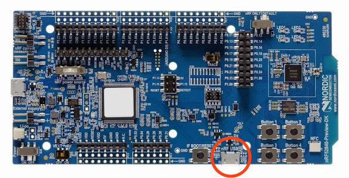

# Android Things LoWPAN Sample

This sample shows how to use LoWPAN to connect multiple Android Things
devices in the same network and wirelessly transfer data. There are
three modules in this sample which demonstrate how to scan for networks,
transmit data, and receive data. To learn more about LoWPAN networks, see the
[LoWPAN API guide](https://developer.android.com/things/sdk/apis/lowpan.html).

## Pre-requisites

- 2 Android Things compatible boards
- Displays or Rainbow Hats
- Android Studio 2.2+
- LoWPAN peripherals

## Integrating LoWPAN Hardware
Android Things boards do not have LoWPAN hardware built in. To interface an
Android Things device with LoWPAN, you need to interface with a supported
Network Co-Processor (NCP) module and install the appropriate user driver.

### Supported modules and firmware
To get started with a development board, visit the OpenThread
[Pre-Built NCP Firmware](https://openthread.io/guides/ncp/firmware) page for
firmware binaries and flashing instructions for supported boards. We recommend the
[Nordic nRF52840-PDK](https://www.nordicsemi.com/eng/Products/nRF52840-Preview-DK)
to get started.

### LoWPAN user driver
The NCP module interfaces to Android Things through a
[user driver](https://developer.android.com/things/sdk/drivers/index.html).
This sample includes the
[LoWPAN NCP driver](https://github.com/androidthings/contrib-drivers/tree/master/lowpan)
to interface with the pre-built OpenThread NCP firmware.
For more details on building your own driver, see the
[LoWPAN driver guide](https://developer.android.com/things/sdk/drivers/lowpan.html).

### Connecting the hardware

The Nordic nRF52840-PDK connects to your Android Things developer board over USB
and exposes a UART to the application. The `nRF USB` port marked below is the
correct port to use:



If you are connecting the board over USB, you must determine the name of the
UART port it creates.

1.  Run the `pio list` command over ADB with the OpenThread board *disconnected*.
    Note the UART names present:

    ```
    $ adb shell pio list uart
    UART6
    ```

1.  Connect the OpenThread board to the USB port on your Android Things kit.
1.  Run the `pio list` command again, and note the new port name:

    ```
    $ adb shell pio list uart
    UART6
    USB1-1:1.0
    ```

1.  Find the port name constant in each activity and replace it with the value
    for your UART:

    ```java
    private static final String UART_PORT = "USB1-1:1.0";
    ```

## Scanner App
The `scanner` module demonstrates how to scan for other networks. It can
view existing networks and provision a new network from the device.

This module requires a screen and input device.

### Getting started

1.  Deploy the `scanner` app module on the first Android Things device.
1.  Tap the **Form Network** button on the display to create a new LoWPAN network
    and attach the device. The status message reports the newly created network
    name.
1.  Deploy the `scanner` app module on the second Android Things device.
1.  Tap the **Scan** button on the display. Within a few moments, the network
    info appears in the list. You can optionally tap the list item to join the
    discovered network.
1.  Finally, tap **Leave** on the first Android Things device to tear down the
    LoWPAN network.

## Transmitter/Receiver App
The `transmitter` and `receiver` app modules demonstrate how to connect
multiple devices to the same LoWPAN network and exchange data over a TCP socket.
The `receiver` app provisions a network called **lowpan_sample**. The
`transmitter` app scans for networks with that name and joins the corresponding
network automatically.

### Getting started

1.  Deploy the `receiver` app module on the first Android Things device
1.  Identify the receiver device's [IP address](#discovering-the-ip-address)
    on the LoWPAN network
1.  Open the `transmitter` module, and enter the IP address from the previous
    section into `TransmitterActivity.java`:

    ```java
    private static final String SERVER_ADDRESS = "<ENTER_IP_ADDRESS>";
    ```

1. Deploy the `transmitter` app module on the second Android Things device

#### Discovering the IP address
OpenThread network interfaces have two separate IP address identifiers:
the **mesh-local** address and the **link-local** address.
See [IPv6 Addressing](https://openthread.io/guides/thread_primer/ipv6_addressing)
for more details on the differences between them.

Enter `adb shell lowpanctl status` to determine the addresses for a LoWPAN
interface. Example:

```
$ adb shell lowpanctl status
wpan1	attached (router) UP CONNECTED COMMISSIONED
  Name:lowpan_sample, PANID:0x5E59, Channel:12
  fd4c:2683:6235:0:9f3e:43f1:1b2d:9006/64      <---- mesh-local address
  fe80::52:64e7:9ca4:802/64                    <---- link-local address
```

Note the **mesh-local** address for use with this sample. In the above example,
that value would be `fd4c:2683:6235:0:9f3e:43f1:1b2d:9006`.

### How to use
If you have a Rainbow Hat or a screen, you can control the `transmitter` module
and view status. It will display "READY" when the sample is ready to connect.

Pressing the **A** button on the Rainbow Hat (or tapping **Connect** on the display)
will initiate a connection to the receiver. It will say "CONNECTED" if successful.

Once that happens you can control a seek bar on the display. Alternatively,
the **B** and **C** buttons on the Rainbow Hat will decrement or increment
the value. The value is then transmitted wirelessly to the receiver device.

After the `receiver` joins the network and accepts the new connection, it will
update the display to say "CONNECTED". Then, as it receives data from the
`transmitter`, it will change the value displayed on both the display and the
Rainbow Hat.

## Enable auto-launch behavior

This sample app is currently configured to launch only when deployed from your
development machine. To enable the main activity to launch automatically on boot,
add the following `intent-filter` to the app's manifest file:

```xml
<activity ...>

    <intent-filter>
        <action android:name="android.intent.action.MAIN"/>
        <category android:name="android.intent.category.HOME"/>
        <category android:name="android.intent.category.DEFAULT"/>
    </intent-filter>

</activity>
```

## License

Copyright 2017 The Android Open Source Project, Inc.

Licensed to the Apache Software Foundation (ASF) under one or more contributor
license agreements.  See the NOTICE file distributed with this work for
additional information regarding copyright ownership.  The ASF licenses this
file to you under the Apache License, Version 2.0 (the "License"); you may not
use this file except in compliance with the License.  You may obtain a copy of
the License at

  http://www.apache.org/licenses/LICENSE-2.0

Unless required by applicable law or agreed to in writing, software
distributed under the License is distributed on an "AS IS" BASIS, WITHOUT
WARRANTIES OR CONDITIONS OF ANY KIND, either express or implied.  See the
License for the specific language governing permissions and limitations under
the License.
